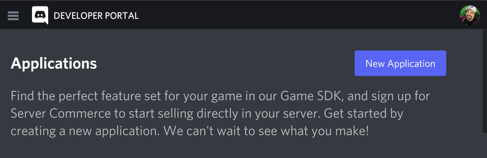
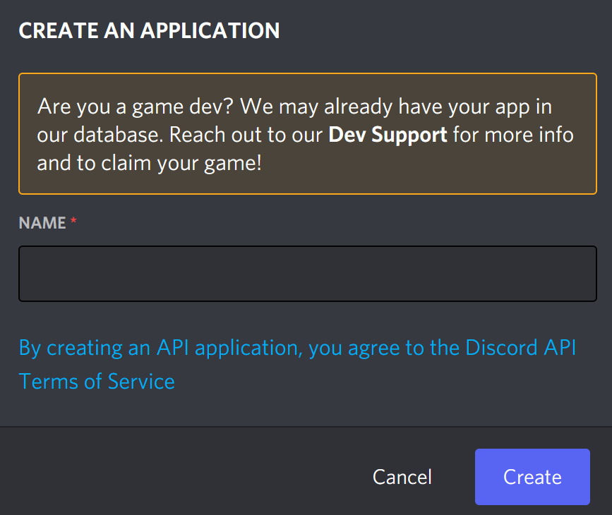
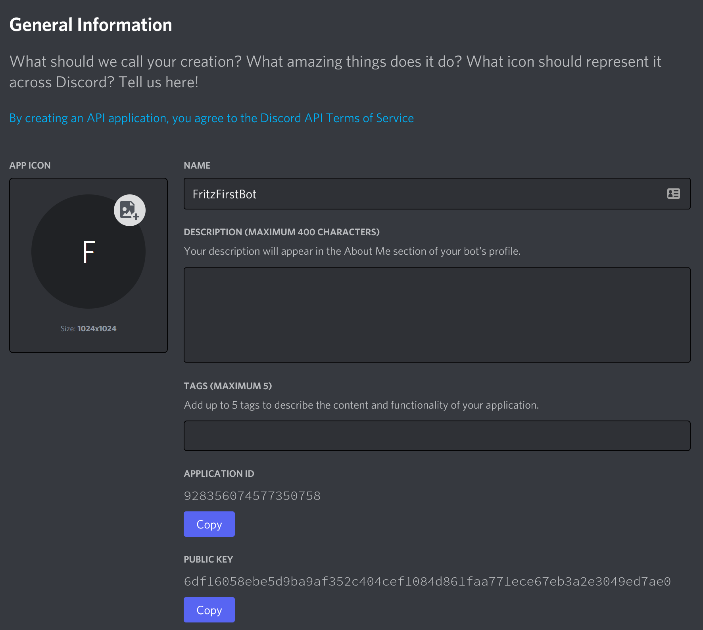
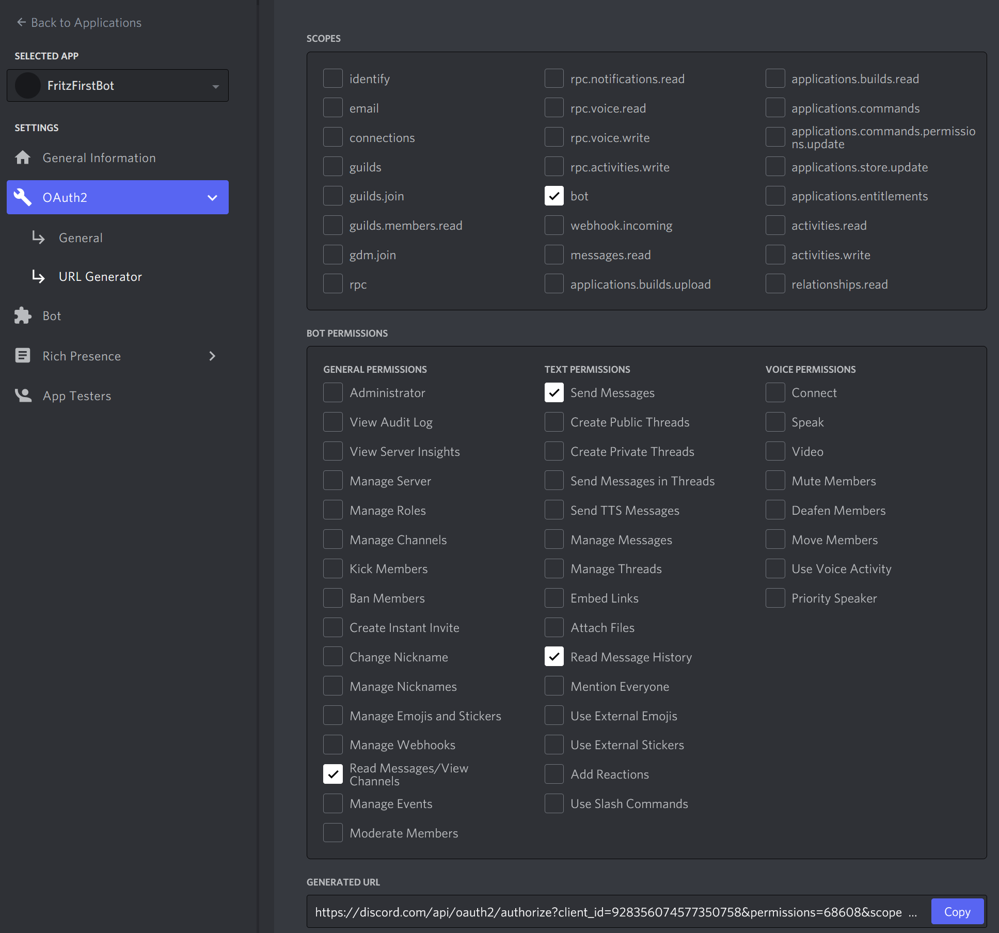

# Session 1115 - Building a Discord Bot

We've learned a bit about how to use the C# language, but we haven't put it together into a meaningful application yet.  In this session, we will assemble some of that knowledge and create a first chat bot that will work with [Discord](https://discordapp.com).

Discord is an online chat platform that you can join, create applications that interact with, chat, voice chat, and socialize on.  Similar to Slack and Teams, Discord has many users in the gaming community.

Along the way in building our application, we are going to learn several important concepts including:

- Using NuGet packages
- ConfigurationBuilder
- User Secrets
- Extension Methods

## Signing up with Discord and defining our bot

Let's get you signed up as a Discord user if you aren't already one by creating an account at https://discordapp.com

Next, head to the developer portal at:  https://discordapp.com/developers/applications/



Click the 'New Application' button to create a Discord Application that will define your bot.  You will next be prompted to give your bot a name:



Don't worry, you can change your bot's name in the next screen.  Here, you'll be able to assign an icon, tags, and other information about your bot.



>>> ADD SCREENSHOTS FOR ADD BOT USER

Next, you'll need to create a URL with permissions for your bot to be able to connect to a server.  Click the `OAuth2` menu item on the left-side and select the `URL Generator` sub-menu.



Copy the URL at the bottom, open it in a new browser and you will be able to have your new bot join a server of your choosing.  However, your bot doesn't have any code yet.  Let's get to that part next.

## Writing your first C# console bot

Let's start with a new .NET 6 console application for your bot.  

```
dotnet new console -o MyFirstBot
```


### Add NuGet package to interact with Discord 

https://www.nuget.org/packages/DSharpPlus/

https://github.com/DSharpPlus/DSharpPlus

```
dotnet add package dsharpplus
```

### Add first code to Program.cs

Get your Bot token from the `Bot` page of the Discord developer portal, and copy it to the clipboard with this `Copy` button:


### Add Configuration

```
dotnet add package Microsoft.Extensions.Configuration.Binder
dotnet add package Microsoft.Extensions.Configuration.Json
```

Read hierarchical values using the `:` separator

### User Secrets

From the [Microsoft Docs](https://docs.microsoft.com/aspnet/core/security/app-secrets), we can add User-Secrets with the following commands:

```
dotnet add package Microsoft.Extensions.Configuration.UserSecrets
```

```
dotnet user-secrets init
```

```
dotnet user-secrets set "discordtoken" "MY TOKEN"
```

### Extension Methods

### Events
