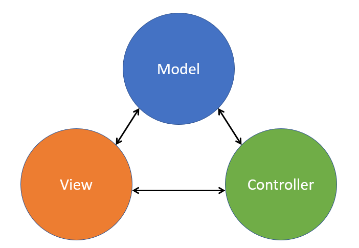
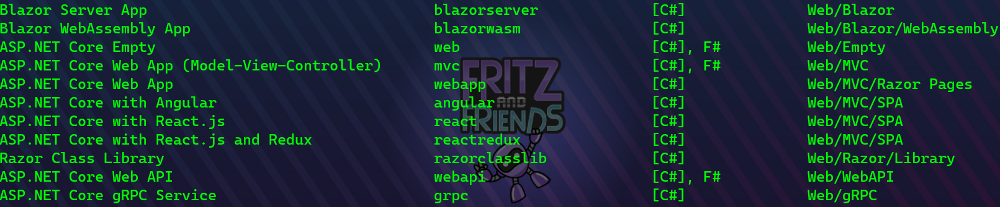
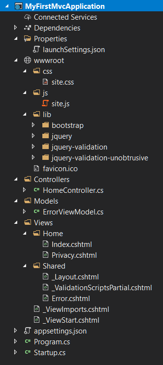

# Session 0202 - Model View Controller

There are three user-interface frameworks that ship with ASP.NET Core.  The legacy framework of the three is MVC or Model-View-Controller.  This framework goes back to 2008 and ASP.NET MVC for .NET Framework.  Inspired by Ruby on Rails, this framework delivers content through a very rigid application architecture, forcing each resultant webpage to be delivered through the accumulation of three files.

In this session, we will learn about the standard architecture of the MVC user-interface framework, how we can deliver web content in different formats while re-using our logic, how routing effects our content, and how we can deliver machine-facing content as well.

## MVC Architecture 101



Model, View, Controller...  its a common project architecture that can be found in different languages and technologies.  

- The **Model** is the data, the information that you want to present to your users
- The **View** is the format of your data, in our case the HTML formatted output for the browser.  Think of this like a template that gets applied to the Model
- The **Controller** applies the business logic of our application to acquire the Model and apply the View.  In ASP.NET Core MVC, the Controller is passed the web request and hands it off to an _Action Method_ that acquires a model and chooses a view to apply.

## File... New MVC Application


_The ASP.NET Core project templates that ship with the .NET SDK_

We can start a new application using the MVC framework with a simple dotnet new command:

```dotnetcli
dotnet new mvc -o MyFirstMvcApplication
```

As we've previously seen, this will build out a folder structure and restore any needed NuGet packages that our project needs.



Looking through the folders and files that are created, we see the same `Program.cs` and `Startup.cs` files that were created in our previous session.  These bootstrap the Kestrel webserver and hand off configuration of the web application to the Startup class where we can operate.

The `wwwroot` folder is back, and we can see that it contains some fairly standard static file content with a `css`, `js`, and `lib` folder with some common CSS and JavaScript frameworks already available for us in this template.

The _interesting bits_ are the middle three folders: `Controllers`, `Models`, and `Views`.  These are the core architectural pieces that make up our application and where we will spend more of our time in this session.

Each folder is named appropriately, containing those part of the architecture inside of it.  We have a single controller class `HomeController.cs` and a single model class `ErrorViewModel.cs`.  The `Views` folder is a little more adventurous with a `Home` and `Shared` child folder with a handful of `cshtml` files inside of each.

## Startup class - configuring for MVC

The `ConfigureServices` method now contains a different signature:

```csharp
public void ConfigureServices(IServiceCollection services)
{
  services.AddControllersWithViews();
}
```

This instructs the ASP.NET Core framework to hand off requests to Controller classes and process razor templated Views to format for the web visitors.

The Configure method ends with this content now:

```csharp
app.UseEndpoints(endpoints =>
{
  endpoints.MapControllerRoute(
    name: "default",
    pattern: "{controller=Home}/{action=Index}/{id?}");
});
```

This pattern defines the _routing_ for our application.  The URL requests are parsed and the first segment that looks like a folder is a reference to the **Controller** that will handle the request.  The second segment refers to the **Action Method** inside the controller that will be run for the interaction.

By default, with URL segments missing, ASP.NET Core will hand off processing to the **Home** controller.  For example, navigating to `http://localhost/` will return the content of the **Home** controller's **Index** method.

If a different first segment is named, then the framework will attempt to access the **Index** method on THAT controller.  Navigating to `http://localhost/Product` will look for the **Index** method on the **Product** controller.

## Controllers

A **Controller** is a fairly standard C# class that inherits from the `Controller` base class. By convention, controllers:

- Reside in the `/Controllers` folder
- Named **Foo**Controller where **Foo** is the URL segment you'd like your visitors to access
- Inherit from the `Controller` base class

```csharp
public class HomeController : Controller
{

  public IActionResult Index()
  {
    return View();
  }

}
```

_Snippet of code from the HomeController.cs file_

### Action Methods

The public methods of a controller should return `IActionResult` or `async Task<IActionResult>` in order to format and present the various types of content for visitors to your application.  The `IActionResult` type carries HTTP Status Code information as well as formatting instructions for ASP.NET Core to apply.

In this sample, the `Index` method is returning the output of the `View` method, which locates an appropriate razor template in the `/Views` folder for this method.  

### Locating Views

When you return `View()` from the `Index` method, the ASP.NET Core framework will look for a file named `index.cshtml` to render.  The filename, by convention, matches the name of the method.  It will look in the following folders for this file:

- `/Views/Home/index.cshtml`
- `/Views/Shared/index.cshtml`

This can be overridden by passing into the `View()` method call a different name of the view file you would like to render.

```csharp
return View("SomeOtherView");
```

### Passing Models to the View

When you return a `View()` you can pass an object into the View method that will be injected into the razor template as a `Model` that can be interacted with in your template.

```csharp
var myHat = new Product {Id=1, Name="C# Hat"};
return View(myHat);
```

In razor, you can then present data and interactions with this object by using the `Model` object.  

## Views

ASP.NET Core uses the [Razor template system](https://docs.microsoft.com/en-us/aspnet/core/mvc/views/razor) to format HTML output.  Razor allows you to mix C# and HTML tags by prefixing your C# code with an `@` symbol.

You can simply place a variable or C# call after the `@` symbol to emit the string output of that code into the output.

```razor

Total items in your cart: @Cart.ItemCount

```

You can emit values mid-tag as well:

```razor

<input type="text" value="@Cart.ShippingAddress" />

```

If you need to output a `@` character in your HTML output, you can just add a second `@` character to indicate that it was escaped.  Also, if you want to explicitly declare a block of text, you can wrap it with the `<text>` tag.

It's easy to write a loop or some conditional code with syntax like:

```razor
@if (true) {

  <ul>
    @foreach (var item in Items) 
    {

      <li>@item</li>

  }
  </ul>

}
```

The above instances are called **implicit razor expressions** and you can write an **explicit razor expression** by wrapping your code with parenthesis like this:

```razor
<b>Minutes left today: @((DateTime.Today.AddDays(1) - DateTime.Now).TotalMinutes)</b>
```

By default, all text content emitted through code, like the `@item` element above is HTMLEncoded to prevent against cross-site scripting attacks.

```razor
	@("<b>bold text</b>")
```

renders:

```html
 &lt;b&gt;bold text&lt;/b&gt;
```

If you want to override this behavior, you can use the `Html.Raw` method

```razor
  @Html.Raw("<b>bold text</b>")
```

renders

```html
  <b>bold text</b>
```

Finally, you can write a block of code to be executed by wrapping it in curly braces:

```razor
@{
  var yesterday = DateTime.Today.AddDays(-1);
}

<b>Yesterday was @yesterday.DayOfWeek</b>

```

### Directives

For MVC interactions with razor, there are a handful of directives that you can use to improve your interactions.  

#### model

You can specify the type of the **Model** object that your controller passed into the template.  This will give your editor, if enabled, intellisense capabilities when referring to the `@Model` object in your code.

#### @using

You can add `@using` statements to the top of your razor template in the same way they are added to a class to help shorten namespace references.

```razor
@using System.IO
```

#### @inject

Perhaps you have a registered service object like a Logger or the application Configuration that you would like to access in your razor template.  You can make that object available with the `@inject` directive specifying a desired type and target variable name.

```razor
@inject ILogger logger
@inject IConfiguration config
```

#### @functions

You can define a block of code that contains functions, that can be called elsewhere in your razor template with the `@functions` block:

```razor
@functions {

  public static int Sum(int arg1, int arg2)
  {
    return arg1 + arg2;
  }

}

<b>@Sum(2,3)</b>
```

@section -- @RenderSection

### Partial Views

## Returning Other Content

Json()

Content()

File()

