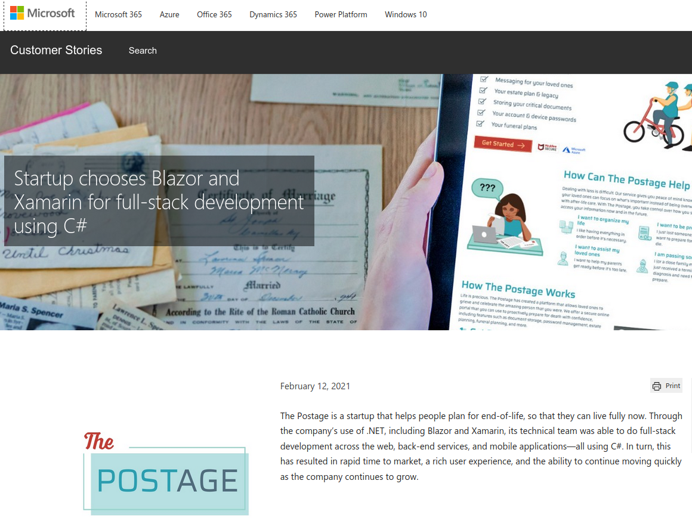
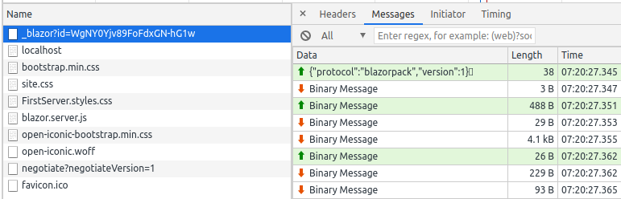

# Session 0301 - Introducing Blazor

[Blazor](https://blazor.net) is the new web user-interface framework from the .NET team that allows you to build component-based, event-driven applications that run in the browser with Web Assembly or on a web server with ASP.NET Core.  Web Assembly delivery of the application means all content is sent to the client for execution.  Server-side execution means the same application runs on ASP.NET Core and rendered content is delivered to the browser with updates managed and delivered with a SignalR connection between browser and server.  With both models, you can use the full .NET and C# development toolset to build end-to-end applications that run in the browser.

Blazor is built with web standards in mind, and works in all modern browsers (including mobile browsers) that fully support the HTML5 specification.

All of the tools you need to get started with Blazor ship with the [.NET SDK](https://get.dot.net) (version 3.1 and later).  You will have great editor support in Visual Studio 2019 and Visual Studio Code.  The included demos are built to work with .NET 5.

## Who's Using Blazor?

Check out the Customer Story for [The Postage](https://customers.microsoft.com/story/1338933582129668706-the-postage-professional-services-azure) where they use Blazor to power the web applications:

    “Using Blazor gave our small development team a huge advantage, enabling the same people to build both the front end and the back end of our solution.  We were intimately familiar with the back-end services we had built, so we were able to use them on the front end much faster. I’d estimate that it cut our development time in half.”

[](https://customers.microsoft.com/story/1338933582129668706-the-postage-professional-services-azure)

## Get Started

Build an app that uses Web Assembly with the default template and explore the folders.  Use the command line:

`dotnet new blazorwasm -o FirstWebAssembly`

This creates a new application using the Blazor Web Assembly model and places the **o**utput in a folder called `FirstWebAssembly`

Explore the folders
- `Pages` is where Blazor application pages live and are written with Razor templates
- `Shared` is where common Razor templates that will be re-used in the application reside.  You'll find layout and component files here
- `wwwroot` is the location containing those static web assets like images, CSS, and JavaScript

Other files to note:
- `Program.cs` is the starting point for the application.  Blazor application configuration starts here
- `App.razor` is the root component that starts the web rendering and contains the Blazor router
- `_Imports.razor` contains shared directives to be used in Razor templates like `@using` statements
- `wwwroot/index.html` is the static HTML page that browsers will read and start using Blazor

Run the application with:

`dotnet run`

Browse to https://localhost:5001 to see the application running.  Be sure to check the network tab, console, and application storage to see where Blazor is interacting.

## WebAssembly with ASP.NET Core Hosted

Very similar to the Web Assembly template, this version of the project template has a complete ASP.NET Core webserver that will assist in rendering and delivering data to the browser.

`dotnet new blazorwasm --hosted -o HostedWebAssembly`

Content is now delivered in 3 applications:  Client, Server, and Shared.

- **Client** is the Blazor Web Assembly application just like we saw previously
- **Server** is the ASP.NET Core application that hosts the server-side Api and will deliver the HTML of the Blazor application.
- **Shared** contains classes that are used by both the client and server projects

Inspect the `Server/Startup.cs` file to see how the Blazor Web Assembly app's `index.html` is referenced as a location to start the application.

```c#
...
app.UseHttpsRedirection();
app.UseBlazorFrameworkFiles();
app.UseStaticFiles();

app.UseRouting();

app.UseEndpoints(endpoints =>
{
    endpoints.MapRazorPages();
    endpoints.MapControllers();
    endpoints.MapFallbackToFile("index.html");
});
```

Run the application and check the Fetch Data sample to see how the application fetches data from the ASP.NET Core `Server` application.

## Server-Side Application

This type of Blazor application runs completely on the server and delivers user-interface updates through a SignalR channel.  Start a new application with:

`dotnet new blazorserver -o FirstServer`

This is an ASP.NET Core application and has a few enhancements to support Blazor.  Look at the `Startup.cs` class to see the enhancements to support the framework.

The contents of the Pages and Shared folders are similar to the Web Assembly app, with the addition of the `_Host.cshtml` file that replaces the `wwwroot/index.html` file that we saw previously.

Run this application and watch the interactions with the server using your browser developer tools.  Pay particular attention to the establishment of the websockets connection.  All .NET processing and painting of the same components presented on screen is managed by the server.



## Interact with C# and HTML

- @bind feature
- Write code in the @code block
- Handle the OnInitialized event

## Pages are components

- @page directive
- Reference other pages using tags

## Inject HTTP client 

- The FetchData samples across the various application models