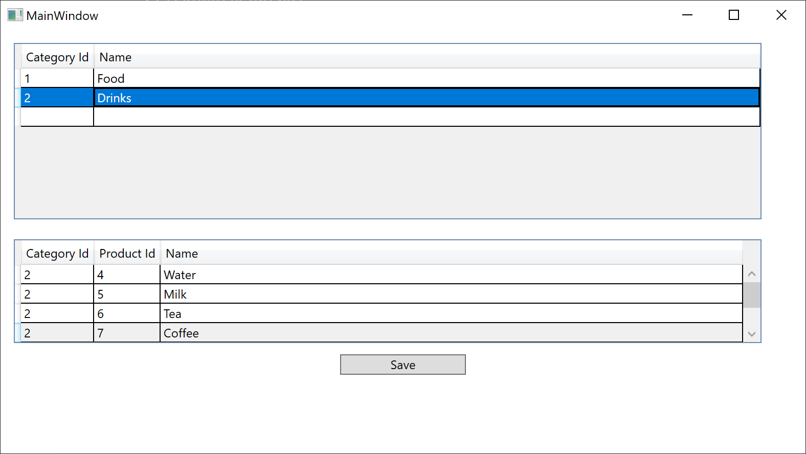

# Session 0503 - Introduction to WPF

In this session, we'll introduce the basics of the Windows Presentation Foundation (WPF) user-interface framework.  WPF has been available to develop with since its initial release in 2006 as part of .NET Framework 3.0 and since then has been updated and released as [open-source](https://github.com/dotnet/wpf) starting with the release of .NET Core 3.0 and continuing through .NET 5 and .NET 6.

## What is WPF?

From the [official documentation](https://docs.microsoft.com/visualstudio/designers/getting-started-with-wpf):

>	Windows Presentation Foundation (WPF) is a UI framework that creates desktop client applications. The WPF development platform supports a broad set of application development features, including an application model, resources, controls, graphics, layout, data binding, documents, and security. The framework is part of .NET, so if you have previously built applications with .NET using ASP.[]()NET or Windows Forms, the programming experience should be familiar. WPF uses the Extensible Application Markup Language (XAML) to provide a declarative model for application programming.

> WPF is resolution-independent and uses a vector-based rendering engine, built to take advantage of modern graphics hardware. WPF provides a comprehensive set of application-development features that include controls, data binding, layout, 2D and 3D graphics, animation, styles, templates, documents, media, text, and typography. WPF is part of .NET, so you can build applications that incorporate other elements of the .NET API.

## What is XAML?

Extensible Application Markup Language (XAML) is a declarative language that's based on XML. XAML is used in the following types of applications to build user interfaces:

 - Windows Presentation Foundation (WPF) apps
 - Universal Windows Platform (UWP) apps
 - Xamarin.Forms apps 
 - .NET MAUI apps _(starting with .NET 6)_

From the [official documentation](https://docs.microsoft.com/dotnet/desktop/wpf/xaml/):

> XAML is a declarative markup language. As applied to the .NET Core programming model, XAML simplifies creating a UI for a .NET Core app. You can create visible UI elements in the declarative XAML markup, and then separate the UI definition from the run-time logic by using code-behind files that are joined to the markup through partial class definitions. XAML directly represents the instantiation of objects in a specific set of backing types defined in assemblies. This is unlike most other markup languages, which are typically an interpreted language without such a direct tie to a backing type system. XAML enables a workflow where separate parties can work on the UI and the logic of an app, using potentially different tools.

> When represented as text, XAML files are XML files that generally have the .xaml extension. The files can be encoded by any XML encoding, but encoding as UTF-8 is typical.

> The following example shows how you might create a button as part of a UI. This example is intended to give you a flavor of how XAML represents common UI programming metaphors.

```xaml
<StackPanel>
  <Button Content="Click Me"/>
</StackPanel>
```

### Markup and Code-Behind

WPF lets you develop an application using both markup and code-behind, an experience with which ASP.NET developers should be familiar. You generally use XAML markup to implement the appearance of an application while using managed programming languages (code-behind) to implement its behavior. This separation of appearance and behavior has the following benefits:

- Development and maintenance costs are reduced because appearance-specific markup isn't tightly coupled with behavior-specific code.

- Development is more efficient because designers can implement an application's appearance simultaneously with developers who are implementing the application's behavior.

- Globalization and localization for WPF applications is simplified.

## Hello World with WPF


Let's create our first application with a simple button that triggers a message box.  We'll create a new WPF application with the command-line command:

```
dotnet new wpf -o FirstApp
```

Next, we'll add some content to the `MainWindow.xaml` to add a button that can be clicked:

```
<Window x:Class="FirstApp.MainWindow"
        xmlns="http://schemas.microsoft.com/winfx/2006/xaml/presentation"
        xmlns:x="http://schemas.microsoft.com/winfx/2006/xaml"
        xmlns:d="http://schemas.microsoft.com/expression/blend/2008"
        xmlns:mc="http://schemas.openxmlformats.org/markup-compatibility/2006"
        xmlns:local="clr-namespace:FirstApp"
        mc:Ignorable="d"
        Title="Window with Button" Height="100" Width="250">

	<!-- The new button we added -->
	<Button Name="button" Click="button_Click">Click Me!</Button>

</Window>
```

Next, we'll give the button some code to trigger by adding the `button_Click` method to the **Code Behind** in `MainWindow.xaml.cs`

```
public void button_Click(object sender, RoutedEventArgs e) {
	
	MessageBox.Show("Welcome to WPF!");

}
```

Finally, we can run the app by clicking the Play button or pressing F5 in Visual Studio.  At the command-line, we can instead execute the command `dotnet run` to start the application.

## Building your first application: the Names application

The Names application is a simple application walkthrough in the [official documentation](https://docs.microsoft.com/dotnet/desktop/wpf/get-started/create-app-visual-studio) and is available with some additional code TODOs in the `src/Names` folder.

## WPF Controls available

The built-in WPF controls are listed here:

- **Buttons:** Button and RepeatButton.

- **Data Display:** DataGrid, ListView, and TreeView.

- **Date Display and Selection:** Calendar and DatePicker.

- **Dialog Boxes:** OpenFileDialog, PrintDialog, and SaveFileDialog.

- **Digital Ink:** InkCanvas and InkPresenter.

- **Documents:** DocumentViewer, FlowDocumentPageViewer, FlowDocumentReader, FlowDocumentScrollViewer, and StickyNoteControl.

- **Input:** TextBox, RichTextBox, and PasswordBox.

- **Layout:** Border, BulletDecorator, Canvas, DockPanel, Expander, Grid, GridView, GridSplitter, GroupBox, Panel, ResizeGrip, Separator, ScrollBar, ScrollViewer, StackPanel, Thumb, Viewbox, VirtualizingStackPanel, Window, and WrapPanel.

- **Media:** Image, MediaElement, and SoundPlayerAction.

- **Menus:** ContextMenu, Menu, and ToolBar.

- **Navigation:** Frame, Hyperlink, Page, NavigationWindow, and TabControl.

- **Selection:** CheckBox, ComboBox, ListBox, RadioButton, and Slider.

- **User Information:** AccessText, Label, Popup, ProgressBar, StatusBar, TextBlock, and ToolTip.

## Working with a Web Service


Let's walk through the image search sample from the Learn Module ["Write Internet Connected Windows Apps"](https://docs.microsoft.com/learn/modules/build-internet-connected-windows10-apps/1-building-app-that-uses-cloud-service?pivots=wpf).  We'll write a simple application that searches Bing for an image and displays it in an image box.

## Databinding with Entity Framework Sample



The Entity Framework team shared [a sample](https://docs.microsoft.com/ef/core/get-started/wpf) that shows how to bind to a simple Parent-Child form to a data source. This sample shows how to use Lazy Loading and CollectionViewSource objects to define and automatically bind a DataGrid to a database table

## Migrating from .NET Framework to .NET Core 

WPF for .NET 5.0 provides new features and enhancements over .NET Framework. To learn how to migrate an app, see [How to migrate a WPF desktop app to .NET 5.](https://docs.microsoft.com/dotnet/desktop/wpf/migration/convert-project-from-net-framework)
