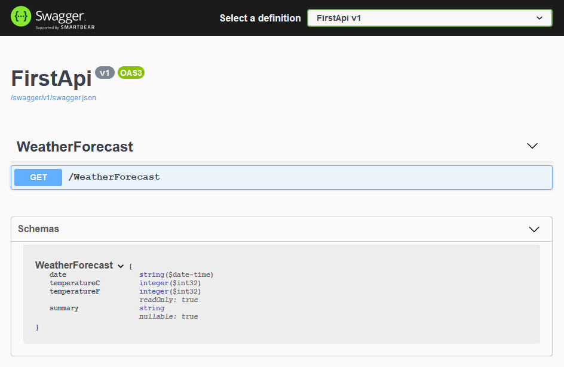

# 0505 - API Design and Development with C# and .NET

In response to [question #79](https://github.com/csharpfritz/csharp_with_csharpfritz/issues/79) we invited Shayne to join us to talk about APIs.

## Topics

- Build an API with ASP()[].NET Core and Swagger
- API Versioning
- Caching
- Pagination Strategies
- Uploading files
- Connecting to a frontend framework: Razor Pages, Blazor, etc
- Deployment - Containers and App Service

## Build your first API with ASP[]().NET Core and Swagger

It's drop dead simple to get your first app running with Swagger to get awesome documentation and interactions for your API.

```cli
dotnet new webapi
```

When you run the app and navigate to https://localhost:5001/swagger you'll find the swagger documentation for your new API:



Customize it further with [Swashbuckle tools](https://docs.microsoft.com/aspnet/core/tutorials/getting-started-with-swashbuckle?view=aspnetcore-5.0&tabs=visual-studio). 

You can generate and build client-side code with the dotnet-openapi tool.  Details at https://docs.microsoft.com/aspnet/core/web-api/Microsoft.dotnet-openapi

## API Versioning

Versioning in Swagger, [Scott Hanselman has a blog post](https://www.hanselman.com/blog/aspnet-core-restful-web-api-versioning-made-easy) to get us started.

## Caching

## Pagination

Pagination has no ideal solution, with different approaches possible:

- Cursor-based paging
- Offset/Count paging
- Keyset-based paging

### Cursor-based paging

```
/products?cursor=abcdefg&limit=10
```

Returns data and an indicator like `next_cursor` so you can make your next request:

```
/products?cursor=hijkl&limit=10
```

**Notable API:** Twitch does this with their [`GetStreams` API](https://dev.twitch.tv/docs/api/reference#get-streams)  

```
GET https://api.twitch.tv/helix/streams?after=abcdefgh12345
```

Returns:

```json
  "data": [
    ...
  ],
  "pagination": {
    "cursor": "ghijk1234"
  }
}
```


### Offset/Count paging

```
/products?offset=10&count=10
```

Returns 10 records starting with record #11 

**Notable API:*** Facebook allows you to query the feed with a link like:

```
https://facebook.com/me/feed?limit=25&offset=50
```

### Keyset-based paging

```
/orders?limit=10&since_id=10123
```

Returns 10 records created AFTER `OrderId` with key 10123

**Notable API:** Twitch provides this pagination with their clips but instead of taking a key, receives a timestamp

```
GET https://api.twitch.tv/helix/clips?started_at=2021-08-01T09:10:00-00:00&first=100
```

## Uploading files to an API

Instead of receiving an input parameter of type string or int, receive an input parameter of type `IFormFile` like this:

```csharp
[HttpPost]
public async Task<IActionResult> UploadFile(
	IFormFile file,
	CancellationToken token
)
{

	using (var stream = new FileStream("somefolder\\myuploadedfile.txt"))
	{

		await file.CopyToAsync(stream);

	}

}
```

The ASP[]().NET team has some [recommendations when handling files](https://docs.microsoft.com/aspnet/core/mvc/models/file-uploads?view=aspnetcore-5.0) for you, and we'll copy them here to ensure you see them:

### Security Considerations

Use caution when providing users with the ability to upload files to a server. Attackers may attempt to:

- Execute denial of service attacks.
- Upload viruses or malware.
- Compromise networks and servers in other ways.

Security steps that reduce the likelihood of a successful attack are:

- Upload files to a dedicated file upload area, preferably to a non-system drive. A dedicated location makes it easier to impose security restrictions on uploaded files. Disable execute permissions on the file upload location.†
- Do not persist uploaded files in the same directory tree as the app.†
- Use a safe file name determined by the app. Don't use a file name provided by the user or the untrusted file name of the uploaded file.† HTML encode the untrusted file name when displaying it. For example, logging the file name or displaying in UI (Razor automatically HTML encodes output).
- Allow only approved file extensions for the app's design specification.†
- Verify that client-side checks are performed on the server. Client-side checks are easy to circumvent.
- Check the size of an uploaded file. Set a maximum size limit to prevent large uploads.
- When files shouldn't be overwritten by an uploaded file with the same name, check the file name against the database or physical storage before uploading the file.
- Run a virus/malware scanner on uploaded content before the file is stored.

### Server Configuration

You will need to [extend the configuration of Kestrel](https://docs.microsoft.com/aspnet/core/mvc/models/file-uploads?view=aspnetcore-5.0#server-and-app-configuration) in order to receive larger files.

## Configuring CORS

[Cross-Origin Resource Sharing (CORS) can be configured](https://docs.microsoft.com/aspnet/core/security/cors?view=aspnetcore-5.0) in your application with a policy using settings like the following:

```csharp

public void ConfigureServices(IServiceCollection services)
{

...

	services.AddCors(options =>
	{
		options.AddPolicy(name: "MyPolicy",
			builder =>
			{
					builder.AllowAnyOrigin();
						.AllowAnyHeader();
			});
	});


}

```

and then add the CORS policy to the HTTP pipeline with:

```csharp
	app.UseRouting();

	app.UseCors("MyPolicy");

	app.UseAuthorization();
```

## Connecting to a front-end framework

With Blazor, use `HttpClient` to request and interact with data from the server:

```csharp
await Http.GetFromJsonAsync<WeatherForecast[]>("https://localhost:5011/WeatherForecast");
```

We can add headers using standard `HttpClient.DefaultRequestHeaders` properties:

```csharp
Http.DefaultRequestHeaders.Add("X-ApplicationId", "My Blazor App");
```

## Deploying - Docker, Azure, etc

## Reference articles

- Brady's API series on DevBlogs:
  - https://devblogs.microsoft.com/aspnet/creating-discoverable-http-apis-with-asp-net-core-5-web-api/
  - https://devblogs.microsoft.com/aspnet/open-source-http-api-packages-and-tools/
	- https://devblogs.microsoft.com/aspnet/app-building-with-azure-api-management-functions-power-apps-and-logic-apps/