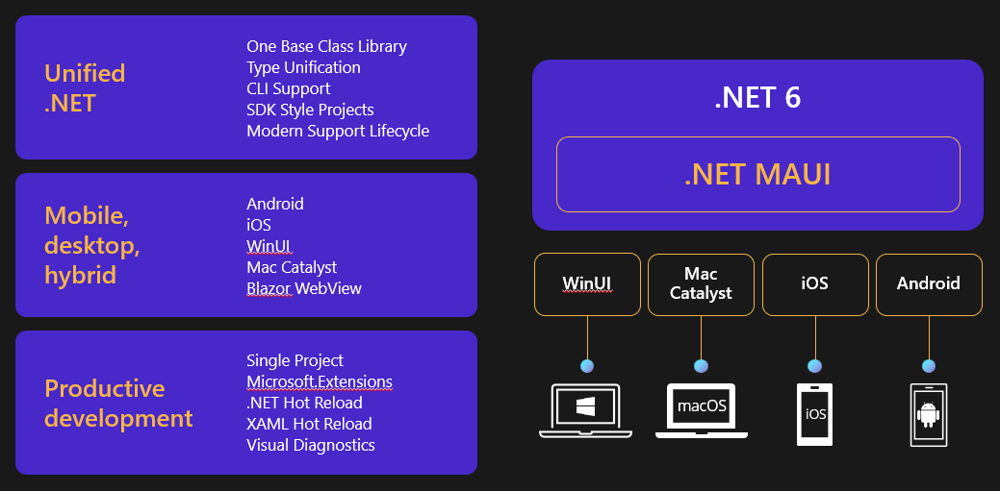
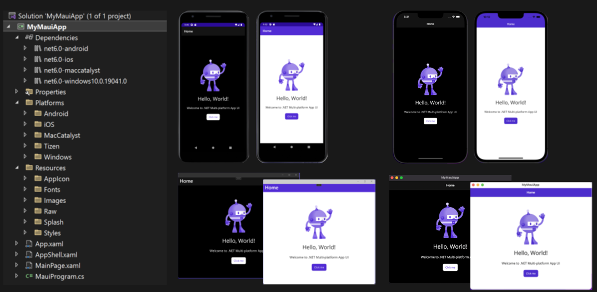
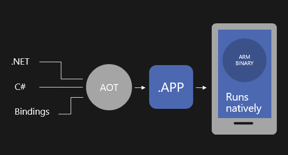
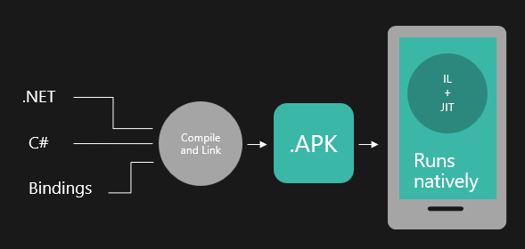

## Session 0601 - Introduction to .NET MAUI

.NET Multi-platform App UI is the most productive way to develop native apps with a single codebase that perform great on any consumer device.

In order to reach all of these devices with beautiful app experiences, we built .NET MAUI to be the most productive way to develop native apps with a single codebase that perform great on any device. Instead of learning different stacks and languages for each device, you can use one language, one set of libraries, and one UI stack for all of them. 

APIs are available directly from C# to access over 60 device platform features including things like isolated storage, sensors, geolocation, camera, and more. Use one programming language, one codebase, and one project system for all device targets with support for cross-platform resources including images, icons, splash screens, and more. .NET MAUI on Windows supports WinUI allowing these apps to use all the newest native features on supported versions of Windows 10 and 11. 

.NET MAUI is built on .NET 6, so that means that you get a single, unified .NET experience across workloads and project types. There is one base class library and unified type system with CLI support. 

.NET MAUI under the hood uses technologies out there today for building native apps on Windows with WinUI, Mac Catalyst for macOS, and of course, iOS and Android. .NET MAUI abstracts all those frameworks into a single framework built on .NET 6. 

.NET MAUI lets web developers build hybrid web apps too. Share Blazor web components directly in .NET MAUI apps while having access to native device capabilities and packaging. By using .NET MAUI and Blazor together, you can reuse one set of web UI components across mobile, desktop, and web.

Visual Studio 2022 includes Hot Reload technology to make you much more productive building .NET MAUI apps. Type code, hit save, and see the changes right away. You can also take advantage of the latest debugging, IntelliSense, and testing features of Visual Studio to write better code faster.

### Native Compilation

Native compilation means that we can compile our C# application to use:

- Android:
  - android.widget
  - AndroidX Libraries
  - Java/Kotlin APIs
- iOS:
  - UIKit
  - ARKit, AVKit, Carplay, and dozens more
  - Objective-C, Swift APIs
- Mac Catalyst
  - UIKit and AppKit
  - Dozens of frameworks
  - Objective-C / Swift APIs
- Windows Applications
  - Windows App SDK
  - WinUI 3
  - C++ APIs

When compiling for iOS:

Code is compiled to a native ARM Binary and deployed as a .APP file to the device

When compiling for Android:

Code is compiled, linked and provided as an .APK that the Google Play store repackages for the various devices they support

### Available Features

| Features | New Capabilities | Changes from Xamarin |
| --- | --- | --- |
| MVVM & XAML | BlazorWebView | Color / Colors |
| Android, iOS, macOS, Windows | Border | Zero'd defaults |
| 7 layouts | Shadows | Namespace |
| 44 Views | GraphicsView | More XAMLC |
| Maui.Essentials | MenuBar | App Startup |
| Maui.Graphics | Windows/Multi-Window | Lifecycle Events |
| Xamarin Forms Compat | Default Theme | .NET Workloads |
| Community Toolkit | AppIcon | |
| | Splash Screen | |
| | Fonts | |
| | Images | |
| | Shell Flyout Templates | |

