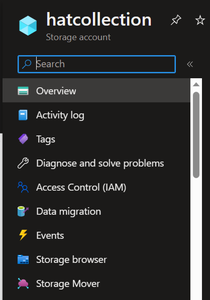

# Session 0703 - Getting Started with Azure Storage

Azure Storage is the easiest way to store and work with data on the Azure cloud service.  Storage is configured with 4 child services that you can use from any device connected to the internet:

- **Blobs** - Files and blocks of data that can be stored and retrieved.  File content can also be accessed in a web browser
- **Tables** - Schemaless storage of data identified by a partition key and a row key.
- **Queues** - First in - First out storage that can be used to store a small block of text
- **File Shares** - File system storage that is used by App Service. 

## Work with storage locally

There is an emulator you can use to work with these storage options locally, and there is are tools you can use to explore the contents of your Azure storage accounts.

### Azurite Emulator

The local emulator available for Azure storage (as of April 2023) is called Azurite and can be installed at: https://learn.microsoft.com/azure/storage/common/storage-use-azurite  

This tool writes all of your data into a folder on your local system.

### Storage Explorer

The Azure Storage explorer will allow you to inspect and work with data in your Azure Storage services both online and in local emulators.  More details and download a copy at:  https://azure.microsoft.com/products/storage/storage-explorer/

For storage accounts on Azure, you can also explore and work with data using a similar experience in the Azure Portal under the **Storage Browser** link on the left menu.

## Interacting with Storage using C#

See blob demos at: https://learn.microsoft.com/azure/storage/blobs/storage-blob-dotnet-get-started