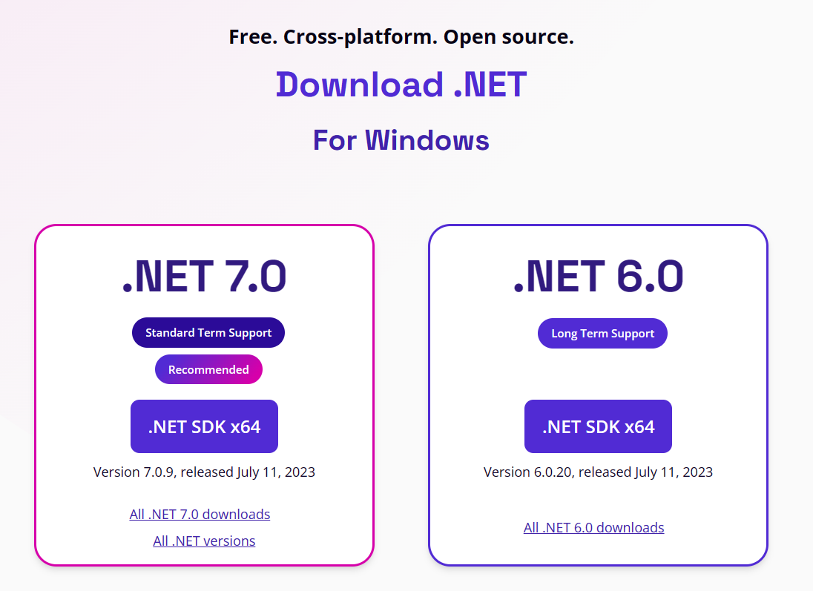

# 0803 - Command Line Tips and Text-Editors

.NET and .NET Core have been built to be command-line driven first.  Visual Studio and other code tools use the same capabilities to build and interact with your projects as the command-line tools.  This means that regardless of which operating system you are using and what tools are available, you can always build and work with .NET code at the command-line.

The terms .NET Command-line interface (CLI) and Software Development Kit (SDK) are used interchangably to refer to the `dotnet` command and tools that can run on Windows, Mac, or Linux  

## Acquisition and setup

While we know .NET comes with Visual Studio, installing the command-line tools is easy from https://dot.net/download  The website will detect which browser and operating system you're using and recommend an immediate download appropriate for your system.



Other downloads for other operating systems are available.

### Install on Linux

Installing on Linux can be performed at the command-line using various package managers and scripts.  

For example, on Ubuntu you can install the .NET 7 version of the SDK using the following command:

```bash
sudo apt-get update && \
  sudo apt-get install -y dotnet-sdk-7.0
```

Additionally, there is a [Linux install script available](https://learn.microsoft.com/dotnet/core/install/linux-scripted-manual#scripted-install) that will attempt download and install the .NET SDK.

```bash
wget https://dot.net/v1/dotnet-install.sh -O dotnet-install.sh
```

Set the script to executable:

```bash
chmod +x ./dotnet-install.sh
```

Finally execute the script to install .NET

```bash
./dotnet-install.sh --version latest
```

[Complete and current directions for installing on Linux](https://learn.microsoft.com/dotnet/core/install/linux) are available on Microsoft Learn.

## Which .NET?

When downloading the SDK, its important to note that all SDKs are fully backwards compatible.  You can optionally specify supported .NET versions to work with older projects.  Unless you have a specific reason to support an older project on a framework that is not currently supported, always download the latest version of the SDK.

You can choose to download a preview version, and know that you can choose which .NET SDK version you are using as they can be run side-by-side on any device.

For example, you can create a new website and specify a framework version using the .NET 8 SDK with any of the following commands to start a website with a template for the .NET 6, .NET 7, or .NET 8 versions:

```bash
dotnet new web -f net6.0
dotnet new web -f net7.0
dotnet new web -f net8.0
```

## Version control with global.json

With every version of the .NET tools, you can create a file called `global.json` that will specify which version of the .NET SDK should be used in that folder and all child folders.

This file contains a minimum version number and directions about which version numbers of the .NET SDK are allowed to be used.

```json
{
  "sdk": {
    "version": "6.0.300",
    "rollForward": "latestFeature",
    "allowPrerelease": true
  }
}
```

More information about [global.json](https://learn.microsoft.com/dotnet/core/tools/global-json) and controlling the .NET SDK can be found on Microsoft Learn.

## Which version do I have installed?

You can report the current version of the .NET SDK detected and running for the current folder with:

```bash
dotnet --version
```

You can see the complete list of runtimes and tools installed with:

```bash
dotnet --info
```

## General Format of dotnet commands

The command-line is set up around a basic "action verb noun" syntax.  You specify a type of action you would like to take, and then an action with additional descriptors to take with that:

```bash
dotnet new web
dotnet run
dotnet build
dotnet watch test
dotnet ef database update
```

All commands have help text available when the `--help` argument is added.

All of the commands shown work the same on every operating system for the same version of the .NET SDK. 

## How do I get additional tools to work with .NET MAUI or WASM projects?

There is an additional set of tools and downloads available that install SDKs and tools to work with iOS, Android, MacOS, and Web Assembly compilers under a feature called `workloads`.

You can view the list of available workloads using:

```bash
dotnet workload list
```

You can install a workload with Android tools using a command like 

```bash
dotnet workload install android
```

## How do I create an application?

You can generate a new application from a template using:

```bash
dotnet new <TEMPLATE NAME>
```

.. but which template should you use?  Get a complete list of templates using:

```bash
dotnet new --list
```

In .NET 8 and newer, the syntax has been simplified to:

```bash
dotnet new list
```

Create a new web site with a command like:

```bash
dotnet new web -n MyCoolWebsite -o src -f net8.0
```

This creates a project called `MyCoolWebsite` in the `src` folder using the .NET 8 framework.

You can start the website using the command:

```bash
dotnet run
```

This will restore any missing packages, build, and launch the application for you.  You can optionally run those steps individually with these commands:

```bash
dotnet restore
dotnet build
```

You can also instruct the command-line to clean any build artifacts on disk with:

```bash
dotnet clean
```

All of these steps in a build and run process are optional, and you can skip them with appropriate command-line arguments:

```bash
dotnet run --no-build --no-restore
dotnet build --no-restore
```

### Release Configuration

You can specify Debug, Release, or another configuration when building your project with the `-c` argument. When not specified, `Debug` is assumed

```bash
dotnet run -c Release 
```

### Building for other runtimes and processor architectures

The runtime and processor of your target machine may not match your current workstation, and you can build for that target by using the `-r` argument with an appropriate term from the list of [available runtimes](https://learn.microsoft.com/dotnet/core/rid-catalog).

For example, to build a project to run on a Raspberry Pi device running Linux, we would target the `linux-arm64` runtime:

```bash
dotnet build -r linux-arm64
```

### Bundling for publication

The `publish` command will bundle a project and get it ready to distribute to another device.  Many of the arguments on the `run` and `build` commands are also available on the `publish` command.  

Let's publish that project for a Raspberry Pi and output to the `dist` folder for distribution:

```bash
dotnet publish -c Release -r linux-arm64 -o dist
```

The configuration for a publication should be `Release`, and starting with .NET 8 that is the assumed value if the `-c` switch is not used.

### Self-contained

Applications from .NET 7 and earlier are published in 'self-contained' mode with all required runtime libraries copied into the output folder.  You can force this behavior in .NET 8 and later with the `--sc` argument.

Projects can be built in 'framework dependent' mode where they depend on the .NET runtime to be installed and available on the target device.  This results in a significantly smaller deployment.  

You can install _JUST_ the runtime using the runtime installer available at the https://dot.net/download location shown previously.  

### Testing

You can execute unit tests within a project by using the `test` command:

```bash
dotnet test
```

### Live Reload

You can activate a live-reload feature for your web applications and test projects using the `watch` command.  This will start the web application or unit test project and watch for changes in the project or its dependencies.  Once a change is detected, it will restart the project or tests.

```bash
dotnet watch  # Run a program 
```

```bash
dotnet watch test  # Execute unit tests
```

## Text editor assistance with Omnisharp

[Omnisharp](https://omnisharp.net) is a library that was built by the .NET Community to enable .NET syntax highlighting and improved interactions in various text editors.  Omnisharp supports:

- [Emacs](https://github.com/OmniSharp/omnisharp-emacs)
- [Sublime Text](https://github.com/OmniSharp/omnisharp-sublime)
- [Vim](https://github.com/OmniSharp/omnisharp-vim)
- Visual Studio Code

Visual Studio Code has an upgraded version of tools that integrate with Omnisharp to give it an improved experience.